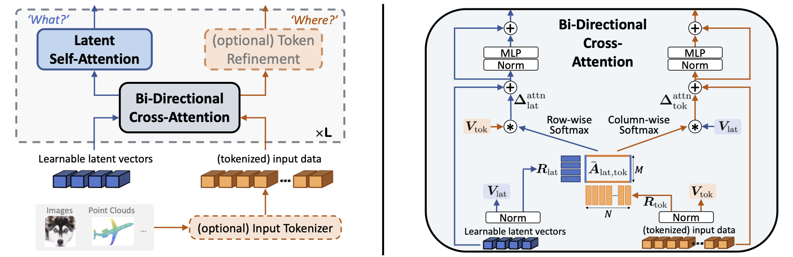

# BiXT - Perceiving Longer Sequences With Bi-Directional Cross-Attention Transformers 
Official PyTorch implementation of the paper **Perceiving Longer Sequences With Bi-Directional Cross-Attention Transformers** (NeurIPS 2024).
<div align="center">

:mortar_board: :page_facing_up: Find our paper: [[arXiv]](https://arxiv.org/pdf/2402.12138) &nbsp; [[NeurIPS]](https://proceedings.neurips.cc/paper_files/paper/2024/hash/ab1ee157f7804a13f980414b644a9460-Abstract-Conference.html) &nbsp;&nbsp;&nbsp;&nbsp;| &nbsp;&nbsp;&nbsp;&nbsp; :milky_way: :chart_with_upwards_trend: [[Poster]](.github/Hiller_Poster_BiXT_NeurIPS2024_s.png) &nbsp;&nbsp;&nbsp;&nbsp;| &nbsp;&nbsp;&nbsp;&nbsp; :mailbox_with_mail: Reference: [[BibTeX]](https://github.com/mrkshllr/BiXT#citing-bixt)
</div>

## Note :pencil: 
- :hourglass_flowing_sand: **Preliminary** code release -- Detailed ***'How To'*** coming soon! :point_left: :eyes:
- :arrow_right: BiXT architecture implemented [here!](timm/models/bixt.py) :bookmark: :point_left:
- :hourglass_flowing_sand: **Trained models coming VERY soon!** :hourglass_flowing_sand: :computer:

## Updates :tada:
- March 04, 2025: *Cleaned-up* **Model, Training and Evaluation code now available** (for ImageNet) :star2: :computer:
- December 13, 2024: **BiXT presented at NeurIPS 2024 in Vancouver, Canada** :mount_fuji: :snowflake:
- September 26, 2024: **BiXT is accepted at NeurIPS 2024!** :fire: 

## TL;DR :eyes:
<div align="center">
  
</div>

**BiXT** is a novel bi-directional Transformer architecture which scales linearly with input size in terms of computational cost and memory consumption, but does not suffer the drop in performance or limitation to only one input modality seen with other efficient Transformer-based approaches. BiXT is inspired by the Perceiver architectures but replaces iterative attention with an efficient bi-directional cross-attention module in which input tokens and latent variables attend to each other simultaneously, leveraging a naturally emerging attention-symmetry between the two. This approach unlocks a key bottleneck experienced by Perceiver-like architectures and enables the processing and interpretation of both semantics ('what') and location ('where') to develop alongside each other over multiple layers -- allowing its direct application to dense and instance-based tasks alike. By combining efficiency with the generality and performance of a full Transformer architecture, BiXT can process longer sequences like point clouds, text or images at higher feature resolutions and achieves competitive performance across a range of tasks like point cloud part segmentation, semantic image segmentation, image classification, hierarchical sequence modeling and document retrieval. Our experiments demonstrate that BiXT models outperform larger competitors by leveraging longer sequences more efficiently on vision tasks like classification and segmentation, and perform on par with full Transformer variants on sequence modeling and document retrieval -- but require 28% fewer FLOPs and are up to 8.4x faster.

---

## Installation and Datasets
For detailed instruction how to set up your environment, install required packages and get access to the ImageNet dataset, please refer to the [installation instructions](https://github.com/mrkshllr/BiXT/blob/main/INSTALL.md).


## Training BiXT from scratch
For a glimpse at the documentation of all arguments that can be adjusted for training, you can run the following command  
```
python3 train_BiXT.py --help
```

>> More details to come soon! For now, check out the [experiment scripts](experiment_scripts).

&nbsp;

## Evaluating BiXT models
To evaluate a trained BiXT model (here `bixt_ti_l64_p16`) on the ImageNet dataset, you can use the evaluation scripts provided in 
```
./experiment_scripts/Eval_bixt_ti_l64_p16/
```
Make sure to define or replace:
* `$DATAPATH`: path to your ImageNet dataset (e.g. /mnt/datasets/ILSVRC2012)
* `$MODEL_CHECKPOINT`: checkpoint of the trained model to be evaluated (e.g. /mnt/bixt_checkpoints/model_best.pth)

The script then runs the evaluation procedure using:
```
python3 evaluate_BiXT.py --model bixt_ti_l64_p16 --model_checkpoint $MODEL_CHECKPOINT --workers 6 --data_path $DATAPATH --validation_batch_size 1024
```

You can also provide your wandb key, user and project name to upload the evaluation results (Acc@1, Acc@5 and Loss) to wandb.

&nbsp;

---
## Citing BiXT
If you find this repository useful, please consider giving us a star :star: and cite our [work](https://arxiv.org/pdf/2402.12138):
```
@inproceedings{
    hiller2024bixt,
    title={Perceiving Longer Sequences With Bi-Directional Cross-Attention Transformers},
    author={Markus Hiller and Krista A. Ehinger and Tom Drummond},
    booktitle={Advances in Neural Information Processing Systems (NeurIPS)},
    pages = {94097--94129},
    volume = {37},
    year={2024},
}
```
If you have any questions regarding our work, please feel free to reach out!

---
For alternative implementations, please also check out [lucidrains' version](https://github.com/lucidrains/bidirectional-cross-attention) (also in PyTorch) and [axrwl's project](https://github.com/axrwl/bidirectional-cross-attention) for a JAX variant.